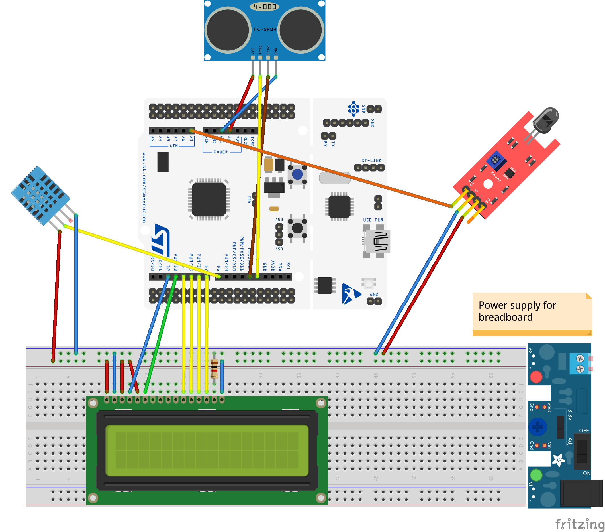
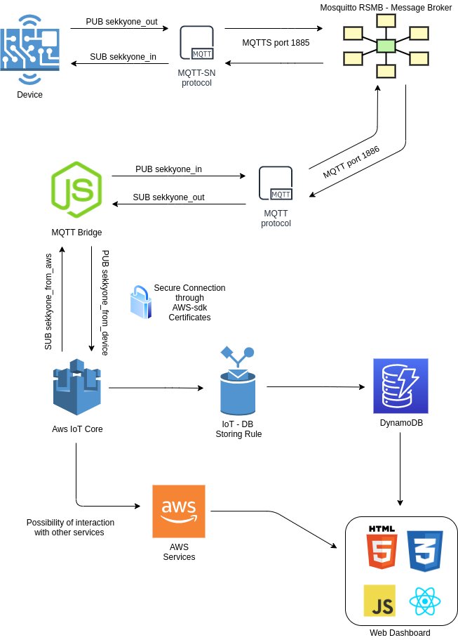

# Sekkyone
Sekkyone is my individual project, a smart garbage bucket that gives you information about filling, internal temperature, flames.

Imagine having a garbage collection system organized by filling, with the possibility of no longer having the full bucket on the street or, in the case, knowing if the bucket is full and waiting / going somewhere else to throw the garbage.

## Introduction to RIOT-OS
[RIOT-OS](https://riot-os.org/) is an open-source microkernel-based operating system designed for a very low memory and energy footprint suitable for embedded devices that depend on real-time capabilities. RIOT provides out-of-the-box support for a very wide low-power wireless and communication stacks, making it an ideal choice to build Internet of Things (IoT) platforms.

## The Board
The [STM32 Nucleo-64 F401RE](https://www.st.com/en/evaluation-tools/nucleo-f401re.html) is a low-cost development board that utilizes a 32-bit ARM Cortex-M4 processor to power various combinations of performance and power consumption. The CPU frequency can go as high as 84 MHz while the power consumption can go as low as 2.4uA at standby without RTC. The STM32 Nucleo board supports the [ARDUINO® Uno](https://en.wikipedia.org/wiki/Arduino_Uno) V3 connectivity headers and the ST morpho headers allowing the easy expansion of the functionality with a wide choice of specialized shields.

## Sensors and Actuators
This is the general circuit schema.


All sensors (listed below) retrieve data periodically every minute. On the LCD (refreshed every minute) are displayed some informations, like temperature and humidity (TH), fill level (F) and AWS connection status/message (S).

### DHT 11 Temperature and Humidity sensor
[DHT11 Temperature & Humidity Sensor](https://www.mouser.com/datasheet/2/758/DHT11-Technical-Data-Sheet-Translated-Version-1143054.pdf) features a temperature & humidity sensor
complex with a calibrated digital signal output. By using the exclusive digital-signal-acquisition technique and temperature & humidity sensing technology, it ensures high reliability and excellent long-term stability. This sensor includes a resistive-type humidity measurement component and an NTC temperature measurement component, and connects to a high performance 8-bit microcontroller, offering excellent quality, fast response, anti-interference ability and cost-effectiveness.

Pin connection schema is the following:
* "S" PIN -> D8 STM
* "+" or "VCC" PIN -> 5V STM
* "-" or "GND" PIN -> ground

DHT11 is used to detect the internal temperature and humidity of the garbage bucket.

### HC-SR04 Ultrasonic distance sensor
Ultrasonic ranging module [HC - SR04](https://cdn.sparkfun.com/datasheets/Sensors/Proximity/HCSR04.pdf) provides 2cm - 400cm non-contact
measurement function, the ranging accuracy can reach to 3mm. The modules
includes ultrasonic transmitters, receiver and control circuit.

Pin connection schema is the following:
* "Trigger" PIN -> D13 STM
* "Echo" PIN -> D12 STM
* "VCC" PIN -> 5V STM
* "GND" PIN -> ground

HC-SR04 is used to calculate the filling level, detecting the distance beetween the cover and the base of the garbage bucket.

### Analog Flame sensor
A [flame sensor module](http://wiki.sunfounder.cc/index.php?title=Flame_Sensor_Module) consists of a flame sensor (IR receiver), resistor, capacitor, potentiometer and comparator in an integrated circuit. It can detect infrared light and applies the principle that the infrared ray is sensitive to flame.

Pin connection schema is the following:
* "AO" PIN -> A0 STM
* "+" PIN -> 5V STM
* "G" PIN -> ground

The flame sensor module is used to detect flames inside the garbage bucket

### LCD1602
LCD1602, or 1602 character-type liquid crystal display, is a kind of dot matrix module to show letters, numbers, and characters and so on. It's composed of 5x7 or 5x11 dot matrix positions; each position can display one character. There's a dot pitch between two characters and a space between lines, thus separating characters and lines. The model 1602 means it displays 2 lines of 16 characters.

LCD1602 can be categorized into eight-port and four-port connections, but for this project we will use the four-port configuration.

This LCD display has multiple pins, connection schema is the following:
* PIN1 (VSS) -> ground
* PIN2 (VDD) -> 5V STM
* PIN3 (VO) -> ground
* PIN4 (RS) -> D2 STM
* PIN5 (RW) -> ground
* PIN6 (E) -> D3 STM
* PIN 7 - 10 -> No connection
* PIN11(D4) -> D4 STM
* PIN12(D5) -> D5 STM
* PIN13(D6) -> D6 STM
* PIN14(D7) -> D7 STM
* PIN15 -> 1kohm resistor -> 5V STM
* PIN16(K) -> ground 

The LCD module is used to display data retrieved by the sensors, directly from the board


## Functioning
The smart garbage bucket uses sensors to calculate filling level, retrieve internal temperature/humidity and detect presence of flames.

These data are sent via MQTT-SN (thanks to emcute driveer) to a MQTT-SN Broker (Mosquitto). Now, via a MQTT Transparent Bridge, data are routed to AWS IOT Core or read by a MQTT Client on local machine.

## Installation
According to [Getting Started RIOT-Docs](https://doc.riot-os.org/getting-started.html), you can obtain the latest RIOT code from the [official repository](https://github.com/RIOT-OS/) where you can find also tutorials, examples and some other interesting stuffs.

Clone my repo and also clone the RIOT directory
```bash
git clone https://github.com/drjack0/iot2020-2021.git
cd iot2020-2021
git clone git://github.com/RIOT-OS/RIOT.git
```
### Setup local MQTT
After setting up the <code>Make.include.ethos</code> file, we are able to connect to the board through a ethernet connection and assign it a IPv6 address.
Now, with an address, STM32 can send messages/data to a MQTT-SN broker

#### MQTT-SN Broker
We will use the [Mosquitto Real Simple Message Broker](https://github.com/eclipse/mosquitto.rsmb) as an MQTT/MQTT-SN broker. For configuring the broker, follow this instructions from the [emcute_mqttsn configuration repo - setting up a broker](https://github.com/RIOT-OS/RIOT/tree/master/examples/emcute_mqttsn).

#### MQTT Local Client
Publishing messages to the Mosquito RSMB can be done with any MQTT library. In this example we will use the [HiveMQ MQTT Cli](https://hivemq.github.io/mqtt-cli/), a full MQTT 5.0 and MQTT 3.1.1 compatible command line interface for MQTT clients which uses the HiveMQ MQTT Client API.

From their github page,if you are using a *nix system which operates with debian packages, install the MQTT Cli in this suggered way.
```bash
wget https://github.com/hivemq/mqtt-cli/releases/download/v4.5.1/mqtt-cli-4.5.1.deb
sudo apt install ./mqtt-cli-4.5.1.deb
```

### MQTT Bridge
To interact with AWS, i created a node.js MQTT-Bridge. For more, open the [corresponding folder](https://github.com/drjack0/iot2020-2021/tree/main/sekkyone/MQTT-bridge), where you can find code and usage schema.

The MQTT-Bridge subscribes "sekkyone_from_aws" topic and automatically publish received message to "sekkyone_in". Likewise, when a message is published to "sekkyone_out" topic, subscribed by the Bridge, it's automatically published to "sekkyone_from_device" topic.

The AWS IoT Core MQTT subscribe "sekkyone_from_device" topic and publish on "sekkyone_from_aws" topic.

This is the network schema



### Some attentions
You need to change a small piece of <code>RIOT hd44780 driver</code> for the display to work.
All this must be done because the default GPIO_PIN system of the driver is not compatible with the STM-32F401RE Board.

First, from the main <code>iot2020-2021</code> folder, move to the correct driver folder where is stored the <code>hd44780_params.h</code> file which contains the default GPIO configuration.
```bash
cd RIOT/drivers/hd44780/include
```
Here, modify the GPIO_PINS, relative to "Arduino D2,D3,D4,D5,D6,D7", in this way
```c
#define HD44780_PARAM_PIN_RS GPIO_PIN(PORT_A, 10)                   /* Arduino D2 */
#define HD44780_PARAM_PIN_ENABLE GPIO_PIN(PORT_B, 3)                /* Arduino D3 */
#define HD44780_PARAM_PINS_DATA         {   GPIO_PIN(PORT_B, 5),     /* Arduino D4 */  \
                                            GPIO_PIN(PORT_B, 4),    /* Arduino D5 */  \
                                            GPIO_PIN(PORT_B, 10),    /* Arduino D6 */  \
                                            GPIO_PIN(PORT_A, 8),    /* Arduino D7 */  \
                                            GPIO_UNDEF,                           \
                                            GPIO_UNDEF,                           \
                                            GPIO_UNDEF,                           \
                                            GPIO_UNDEF }
```

Now, you can compile all the code without issues.

### Extras
Opening <code>makefile</code> you can personalize some parameters, including *BUCKET_HEIGHT* (setting your personal bucket heigth), *EMCUTE_ID* (for device ID naming), *MQTT_TOPIC_OUT* and *MQTT_TOPIC_IN* (rsmb default topics for device messages)

## Usage

### Local communication

The goal is to *publish sensor's data*, at a certain topic, to the MQTT-SN Broker (Mosquitto) from the STM32 Board, making sure the MQTT Client receives them right away.

1. Start the Mosquitto RSMB: <code>./broker_mqtts config.conf</code>
2. Connect the mqtt client: <code>mqtt sub -h 127.0.0.1 -p 1886 -V 3 sekkyone</code>
3. Flash and connect the STM32 board: <code>make BOARD=nucleo-f401re flash term</code>
4. Waiting for data to be sent by STM32 and received first from the Broker and later from the MQTT Client

Note that the **process is automatic**, with no need for commands to run on the board

### AWS interaction

The goal is to *publish sensor's data*, at a certain topic, to the MQTT-SN Broker (Mosquitto) from the STM32 Board, making sure the MQTT-Bridge receives them right away and could interact with AWS IoT Core.

1. Start the Mosquitto RSMB: <code>./broker_mqtts config.conf</code>
2. Start the [MQTT-Bridge](https://github.com/drjack0/iot2020-2021/tree/main/sekkyone/MQTT-bridge): <code>npm start</code> (in MQTT-Bridge directory)
3. Flash and connect the STM32 board: <code>make BOARD=nucleo-f401re flash term</code>
4. Waiting for data to be sent by STM32 and received first from the Broker, then from the Bridge and later from AWS

Note that the **process is automatic**, with no need for commands to run on the board