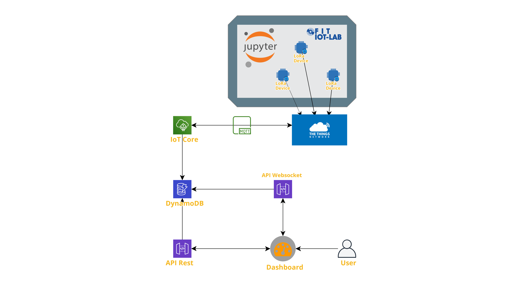

# Sekkyone LoRa and LoRaWan Testbed

Third Individual Assignment for the IoT 2021 Course @ Sapienza University of Rome. For more informations about sekkyone project, [follow this link](https://github.com/drjack0/iot2020-2021/tree/main/sekkyone), return to the main directory or have read the [blog post]().

In this folder you can have a look to:
* **dev folder**: Modified main.c and makefile
* **extra**: Jupyter notebook related to LoRaWan experiment and extra material for LoRa integration

Here is a [blog post](https://drjack0.medium.com/sekkyone-smart-garbage-bucket-2d1e88ba5505) with informations on the overall system

## Questions

First of all, let's answer some questions about the course

### How is the long-range low-power wide are network going to affect the IoT platform?

Sekkyone was born with the idea of ​​being a "plug n play" solution, therefore capable of being mounted inside any public bucket without the need for a nearby internet network.
Being able to use long-range networks allows you to reach even more isolated areas, just think of farms or manufacturing companies.
As "sekkyone" is conceived, it is not necessary to have data in "real time", nor is it essential to limit the delay in transmission, which is why a "long range" solution is interesting.
Messages sent by devices to the cloud are under 123-byte maximum payload size of SF9 (Spreading Factor 9), also obtaining a decent transmission speed.

Precisely because of the limitations imposed by the use of LoRa, always keeping in mind the energy efficiency of the devices, it is important to limit the exchange of messages between nodes and network infrastructure as much as possible, setting thresholds (max and min) within which the values ​​are considered normal, so as to send data only when the measurements exceed the critical limits

For more information about LoRa Airtime, [this table](https://avbentem.github.io/airtime-calculator/ttn/eu868/112) is very useful.

### What are the connected components, the protocols to connect them and the overall IoT architecture?

* **Nodes -** The nodes in IoT-Lab are the [st-lrwan1](https://www.iot-lab.info/docs/boards/st-b-l072z-lrwan1/), based on ST B-L072Z-LRWAN1 model
* **Protocols**
    * **Nodes to TTN -** LoRaWan specification, a Low Power, Wide Area networking protocol designed to wirelessy connect battery operated "thing" to the internet in wide areas 
    * **TTN to IoT Core -** MQTT protocol, with direct integration beetween TTN and AWS
* **Cloud Infrastructure -** TTN (The Things Network) is an intermediate beetween AWS IoT Core (and all the AWS Cloud suite) and hardware devices of Sekkyone Network

### Performance Evaluation
It was not possible to carry out the performance evaluation due to various malfunctions in the FIT / IoT-Lab system, so the few LoRa nodes in the IoT-Lab network with the ability to detect metrics are unable to function as of today

## Main System Setup

You can find **device firmware** in the *dev* folder. To continue in the tutorial, it is necessary to keep in mind the `APP_EUI`, `DEV_EUI` and `APP_KEY` values ​​coming from TTN, which will then be inserted in the code for the configuration of the LoRa nodes before compiling and flashing the firmwares.

### AWS Setup
1. Create and AWS IoT Core application
2. Set up an [IoT Rule]
`SELECT <important data> FROM "ttn/sekkyone_from_device"` that puts data in a DynamoDB Table
3. Set up the AWS backend infrastructure as shown [here](./../sekkyone/WebApp/sekkyone-backend) and configure all the IAM Roles
4. Create / Clone a [Dashboard](./../sekkyone/WebApp/sekkyone-frontend)

### TTN Setup
Create a *TheThingsNetwork* application and register as many devices as you want. The application, at the moment on the v2 stack, must have the following characteristics:

* LoRaWAN Version: MAC V1.0.2
* Regional Parameters Version: PHY V1.0.2 REV B
* Frequency Plan: EU 863-870 Mhz (SF9 for RX2)
* Activation mode: OTAA (important!)

Since the messages arriving on TTN are Base64, it is necessary to format them in a human readable way to use them. For this, [here](./extra/decoder.js) is a short code to decode hex, to be inserted in the "Payload formatter" section in the TTN settings.

### IoT-Lab Setup
In the *extra* folder you will find the jupyter notebook relating to the experiment with LoRa nodes carried out on IoT-Lab. To set up the testbed correctly, simply follow the steps listed in the [notebook](./extra/sekkyone-lora.ipynb)

## Backend and Dashboard implementations
To properly manage the uplink messages arriving from TTN, it was necessary to add some "decode" code which, once the message is received from LoRa Network, takes it from "base64" to "json", sending it from TTN to IoT-Core.

For messages of this type, i have set up a special topic on Iot-Core `ttn/sekkyone_from_device`.

No dashboard implementations or changes needed.

For more informations about AWS-TTN integration, have a look [here](https://aws.amazon.com/it/blogs/iot/connect-your-devices-to-aws-iot-using-lorawan) for some references!