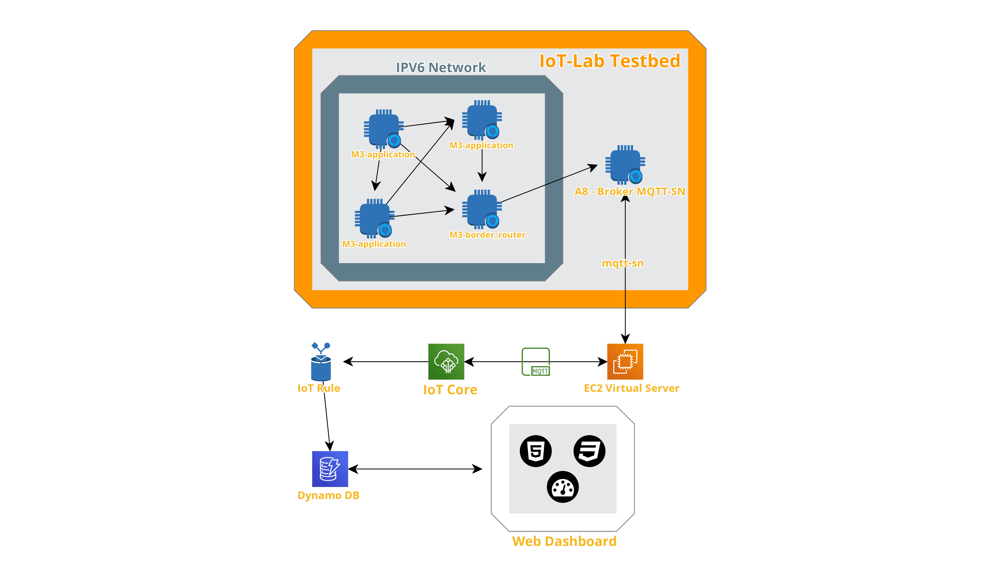

# Sekkyone IPV6 Testbed

Second Individual Assignment for the IoT 2021 Course @ Sapienza University of Rome. For more informations about sekkyone project, [follow this link](https://github.com/drjack0/iot2020-2021/tree/main/sekkyone) or return to the main directory.

## Questions

First of all, let's answer some questions about the course

### How is the deployment of multiple sensors going to affect the IoT platform?

For this kind of application, remembering that sekkyone is something like a box to be installed inside the garbage bucket, a LowPan network can be useful in case there are more buckets nearby of the same type or, for example, for separate collection.

The benefit of deploying multiple products in this way is to save on LoraWan messages, creating "areas" of operation.

The main limitation of such a network lies in the response times in interfacing with the cloud and in the possibility of packet loss in the internal network, as well as some errors of the platform *IoT-Lab* itself

### What are the connected components, the protocols to connect them and the overall IoT architecture?

The system used for the experiment uses an EC2 Machine for message brokering and two kinds of nodes from the testbed:
* 2+ [IoT-Lab M3 nodes](https://www.iot-lab.info/docs/boards/iot-lab-m3/), one of which acts as a border router of the mesh network while the remaining ones run the application firmware. This one has been suitably modified to run on the nodes of the IoT-Lab system, simulating the data of the various sensors connected to the STM-32 nucleo board
* 1 [IoT-Lab A8 node](https://www.iot-lab.info/docs/boards/iot-lab-a8-m3/), which hosts the MQTT-SN mosquitto.rsmb broker and relative [configuration file](./iot-lab/config.conf)
* Cloud components, which remain mainly the same, except for some changes to the script that acts as a mqtt bridge between mosquitto and aws, this time hosted not locally but on a special ec2 machine. A [jupyter notebook](./iot-lab/sekkyone-mesh.ipynb) is also employed to interact with the testbed

### How do you measure the performance of the system?

Overall system performance was measured using the tools offered directly by IoT-Lab. Here are placed some plots (power,voltage, current and radio monitoring) for every node.

#### Node A8

#### Node M3 - Border Router

#### Node M3 - 1

#### Node M3 - 2

#### Node M3 - 3

### Wireless Performance

As expected from the iot-lab docs, the measured RSSI for all the nodes is always near -91dBm, so we have not too much noise nor interference.

Sometimes messages from the devices did not manage to correctly arrivate to the router and, other times, there are troubles in making the nodes reach the ipv6 address of the mqtt-sn broker.

To avoid difficulties or collisions, it is advisable to differentiate the firmware flashing of the various application nodes

### Power,Current and Voltage Consumption

We can read that power, current and voltage consumptions are not soo heavy and are approximately similar in the 3 application nodes that have the same firmware.

From the graphs we can see that there is an initial peak due to the firmware flash and various subsequent minor peaks, corresponding to the various measurements which, although simulated, temporarily awaken the device

## EC2 Machine

For the EC2 machine code and usage, see the script in its relative folder and upload it to your cloud server. Access the Server with ssh, open 1883 port and start the script, that will listen for incoming communications on port previously mentioned

## IoT-Lab Setup

In order to set up the FIT/IoT-Lab enviroment, it is enough to follow the [Jupyter notebook](./iot-lab/sekkyone-mesh.ipynb) provided in the iot-lab folder, which explains every step to perform in order to reproduce the experiment, flash the firmwares and run the MQTT/SN broker.

